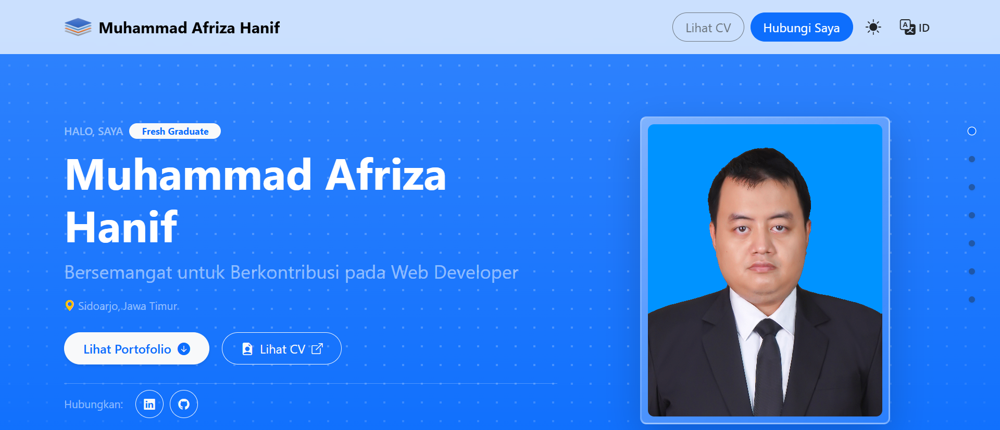

# 💼 M. Afriza Hanif – Portofolio Interaktif & CV Modern

<p align="center">
  <a href="https://skillicons.dev">
    
  </a>
</p>

<p align="center">
  <a href="README.md">English</a> | <b>Bahasa Indonesia</b>
</p>

<p align="center">
  <b>Website curriculum vitae dan portofolio interaktif yang modern, responsif, dan berorientasi pada performa tinggi.</b><br />
  Dibangun dengan Next.js App Router, TypeScript, dan Bootstrap 5.
</p>

<p align="center">
  <a href="https://afrizahanif.com"><strong>🌐 Jelajahi Live Demo »</strong></a>
</p>

---

## 📸 Preview



---

## ✨ Fitur Utama

- ⚡ **Performa Cepat & Siap SEO:** Dibangun dengan Next.js App Router, metadata dinamis, dan optimasi OpenGraph.
- 📱 **Mobile-First & Responsif:** Tata letak bersih yang dirancang dengan Bootstrap 5 serta kustom SCSS modular.
- 🗺️ **Peta Interaktif Leaflet:** Komponen peta dinamis untuk menampilkan lokasi kerja / jangkauan proyek.
- 📬 **Formulir Kontak Interaktif:** Integrasi form kontak bawaan lengkap dengan validasi dan perlindungan spam.
- ♿ **Aksesibel & Semantik:** Mematuhi standar aksesibilitas web modern serta hierarki HTML5 yang semantik.

---

## 🛠️ Tech Stack

### Core & Framework

- [Next.js](https://nextjs.org/) (v16 App Router)
- [React](https://react.dev/) (v19)
- [TypeScript](https://www.typescriptlang.org/) (v5)

### Styling & UI

- [Bootstrap](https://getbootstrap.com/) (v5.3)
- [SASS / SCSS](https://sass-lang.com/)
- [Bootstrap Icons](https://icons.getbootstrap.com/)

### Library & Peralatan

- [Leaflet](https://leafletjs.com/) (Peta Interaktif)
- [ESLint](https://eslint.org/) (Linting dan kualitas kode)
- GitHub Actions & Lighthouse CI (Otomatisasi deployment dan audit)

---

## 📊 Lighthouse Benchmark

| Metrik                | Skor  |    Status    |
| :-------------------- | :---: | :----------: |
| ⚡ **Performance**    | `95+` | 🟢 Excellent |
| ♿ **Accessibility**  | `95+` | 🟢 Excellent |
| 🛡️ **Best Practices** | `100` |  🟢 Perfect  |
| 🔍 **SEO**            | `100` |  🟢 Perfect  |

> 🔗 **Audit & Verifikasi Langsung:**
>
> - Jalankan audit _real-time_ langsung di [Google PageSpeed Insights](https://pagespeed.web.dev/analysis?url=https%3A%2F%2Fafrizahanif.com)
> - Status audit otomatis CI/CD: [](https://github.com/AfrizaHanif/curriculum-vitae-react-v2/actions/workflows/deploy.yml)

---

## 🚀 Memulai (Getting Started)

Ikuti langkah-langkah berikut untuk menjalankan proyek ini secara lokal di komputer Anda.

### Prasyarat

- [Node.js](https://nodejs.org/) (disarankan v20.x atau lebih baru)
- `npm` (terpasang otomatis bersama Node.js)

### Instalasi

1. Clone repositori ini:

   ```bash
   git clone https://github.com/AfrizaHanif/curriculum-vitae-react-v2.git
   cd curriculum-vitae-react-v2
   ```

2. Pasang dependensi:

   ```bash
   npm install
   ```

3. Konfigurasi environment variables:

   ```bash
   cp .env.example .env.local
   ```

   Buka file `.env.local` dan sesuaikan nilai variabel sesuai kebutuhan.

   > 💡 **Tips Pengujian Lokal:**  
   > Ubah `NEXT_PUBLIC_MOCK_SUBMISSION=true` jika Anda ingin menguji pengiriman formulir kontak secara lokal tanpa memerlukan akun Formspree atau kuota aktif.

4. Jalankan server pengembangan lokal:

   ```bash
   npm run dev
   ```

5. Buka [http://localhost:3000](http://localhost:3000) di browser Anda untuk melihat hasilnya.

---

## 📜 Perintah yang Tersedia (Scripts)

Di dalam direktori proyek, Anda dapat menjalankan perintah berikut:

| Perintah             | Deskripsi                                      |
| :------------------- | :--------------------------------------------- |
| `npm run dev`        | Menjalankan aplikasi dalam mode dev (Webpack)  |
| `npm run build`      | Membangun bundel produksi aplikasi             |
| `npm run start`      | Menjalankan bundel produksi yang telah dibuild |
| `npm run lint`       | Memeriksa format kode dan potensi isu linter   |
| `npm run type-check` | Memvalidasi tipe TypeScript di seluruh proyek  |
| `npm run sync-data`  | Menjalankan skrip sinkronisasi data            |

---

## 📁 Struktur Proyek

```text
curriculum-vitae-v2/
├── public/              # Aset statis publik (gambar, dokumen, ikon)
├── src/
│   ├── app/             # Halaman dan layout Next.js App Router
│   ├── assets/          # Aset internal (font, gambar, audio)
│   ├── components/      # Komponen UI modular yang dapat digunakan kembali
│   ├── context/         # React Context untuk state global
│   ├── data/            # Data JSON statis (profil, proyek, pengalaman)
│   ├── hooks/           # Kumpulan custom React hooks
│   ├── styles/          # Kumpulan file styling (.scss & .css)
│   ├── types/           # Definisi tipe dan interface TypeScript
│   └── utils/           # Fungsi utilitas dan helper
├── scripts/             # Skrip otomatisasi dan sinkronisasi data
├── .env.example         # Template contoh variabel lingkungan
└── next.config.ts       # Konfigurasi Next.js
```

---

## 📬 Kontak & Sosial

- **Nama:** Muhammad Afriza Hanif
- **LinkedIn:** [linkedin.com/in/afrizahanif](https://linkedin.com/in/afrizahanif)
- **GitHub:** [@AfrizaHanif](https://github.com/AfrizaHanif)
- **Email:** <afrizahanif728@gmail.com>
- **Website:** [afrizahanif.com](https://afrizahanif.com)

---

## 💡 Alur Pengembangan & Kolaborasi

Dirancang dan dikembangkan secara mandiri oleh **Muhammad Afriza Hanif**, dengan memanfaatkan alur kerja modern dan _AI pair-programming_ (Google Gemini / Claude) untuk peninjauan kode, audit aksesibilitas, dan efisiensi produktivitas.

---

## 📄 Lisensi

© 2026 Muhammad Afriza Hanif. Hak cipta dilindungi undang-undang (_All rights reserved_).

Kode sumber ini disediakan secara publik hanya untuk keperluan evaluasi, peninjauan kode (_code review_), dan rekrutmen. Penyalinan, redistribusi, atau penggunaan tanpa izin atas konten, aset, desain, dan identitas pribadi dilarang.
